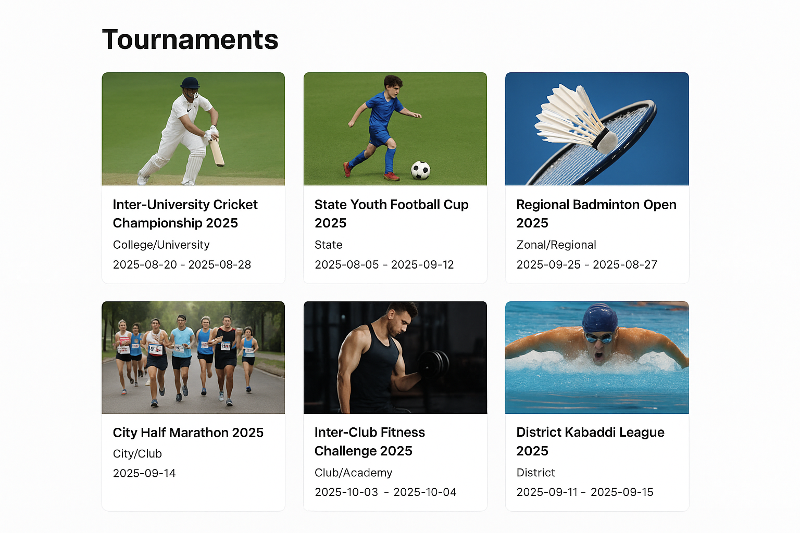

# GenAI Intern Assignment — Tournament Calendar (MVP)

**Author:** Sree Vamsi  
**Role:** GenAI Intern — StapuBox assignment submission

---

## What this repo contains
- `app.py` — Flask app exposing:
  - `GET /api/tournaments` — JSON API (query params: `sport`, `level`, `limit`)
  - `GET /api/tournaments/csv` — Download CSV
  - A basic UI at `/` (index.html)
- `db_schema.sql` — SQLite schema
- `populate_db.py` — Load sample JSON into `tournaments.db`
- `data/sample_tournaments.json` — Sample dataset (12 events)
- `templates/index.html`, `static/app.js` — Simple UI
- `sample_output.csv` — Example CSV export (you can re-generate)

---

## Sample Output

### Web UI Interface
The application provides a clean, responsive web interface for browsing tournaments:

```
┌─────────────────────────────────────────────────────────────────┐
│                    GenAI Tournament Calendar — Demo              │
├─────────────────────────────────────────────────────────────────┤
│ Sport: [All ▼]  Level: [All ▼]  [Filter]  [Download CSV]        │
├─────────────────────────────────────────────────────────────────┤
│ ┌─────────────┐ ┌─────────────────────────────────────────────┐ │
│ │             │ │ Cricket — Inter-University Cricket          │ │
│ │   [Image]   │ │ Championship 2025                           │ │
│ │             │ │ College/University | 2025-08-20 → 2025-08-28│ │
│ └─────────────┘ │                                             │ │
│                 │ A multi-university cricket tournament       │ │
│                 │ featuring 16 teams across the region...     │ │
│                 │                                             │ │
│                 │ Official | Watch                            │ │
│ └─────────────────────────────────────────────────────────────┘ │
│                                                                 │
│ ┌─────────────┐ ┌─────────────────────────────────────────────┐ │
│ │             │ │ Football — State Youth Football Cup 2025    │ │
│ │   [Image]   │ │ State | 2025-09-05 → 2025-09-12             │ │
│ │             │ │                                             │ │
│ └─────────────┘ │ State-level youth football cup with district│ │
│                 │ winners from across the state...            │ │
│                 │                                             │ │
│                 │ Official | Watch                            │ │
│ └─────────────────────────────────────────────────────────────┘ │
└─────────────────────────────────────────────────────────────────┘
```

### API Response Example
```json
{
  "count": 2,
  "results": [
    {
      "sport": "Cricket",
      "name": "Inter-University Cricket Championship 2025",
      "level": "College/University",
      "start_date": "2025-08-20",
      "end_date": "2025-08-28",
      "official_url": "https://example-univ-cricket.example.com",
      "streaming_links": ["https://youtube.com/example-univ-cricket"],
      "image_url": "https://via.placeholder.com/400x250?text=Cricket+Championship",
      "summary": "A multi-university cricket tournament featuring 16 teams across the region, focusing on student athletes and talent scouting."
    }
  ]
}
```

### CSV Export Sample
```csv
sport,name,level,start_date,end_date,official_url,streaming_links,image_url,summary
Cricket,Inter-University Cricket Championship 2025,College/University,2025-08-20,2025-08-28,https://example-univ-cricket.example.com,"[""https://youtube.com/example-univ-cricket""]",https://via.placeholder.com/400x250?text=Cricket+Championship,A multi-university cricket tournament featuring 16 teams across the region, focusing on student athletes and talent scouting.
```

---

## Quick setup (Linux/macOS/WSL)
1. Clone or copy files into a folder.
2. Create Python venv and install Flask:
   ```bash
   python3 -m venv venv
   source venv/bin/activate
   pip install flask
   ```
3. Populate DB with sample data:
   ```bash
   python populate_db.py
   ```
4. Run the app:
   ```bash
   python app.py
   ```
5. Open UI: http://127.0.0.1:5000/
   API: http://127.0.0.1:5000/api/tournaments

## How to replace sample data with live, up-to-date tournaments
(You must verify final tournament data before submission)

### Option A — Use a sports data API

Sign up for a sports API provider (e.g., TheSportsDB, SportdataAPI, RapidAPI sports endpoints, or official federation APIs).

Write an ETL script that:
- Fetches upcoming tournament lists for the sports in scope.
- Normalizes fields to match our schema (ISO dates, streaming links as JSON list).
- Inserts/updates the SQLite DB (or swap to a cloud DB if needed).

Example code template (pseudo):
```python
import requests
items = requests.get("https://api.sportsdata/...").json()
for it in items:
    normalized = {...}
    insert_tournament(conn, normalized)
```

### Option B — Use Google Custom Search / scraping for local tournaments

Set up Google Custom Search API + CSE to target official federation and local district sites.

Use the CSE results to scrape pages for dates/links and verify manually.

Because tournament pages differ in format, build small scrapers per federation or use manual verification.

**Important:** The assignment requires upcoming real tournaments. After pulling data, manually verify at least the top 10 tournaments by checking official pages (or federation announcements) — include the source links in your submission notes.

## API spec
`GET /api/tournaments? sport=<sport>&level=<level>&limit=<n>`

Returns JSON: `{ count: N, results: [ ... ] }`

Fields for each tournament:
- sport, name, level, start_date, end_date, official_url, streaming_links (array), image_url, summary

## System design & approach (short)
- **Data layer** — local SQLite for simplicity; schema normalized for required fields and indices for fast filtering.
- **API layer** — simple Flask app that supports JSON and CSV exports and filtering.
- **UI** — Plain HTML + jQuery to keep the frontend minimal and compatible with the brief ("no React unless confident").
- **Data ingestion** — Scripted JSON import for portability. Real ingestion would use either proper sports APIs or crawlers with RAG validation.
- **Accuracy & verification** — Because tournament schedules change, ingestion must include last_verified and ideally a webhook or scheduled fetcher (cron job) to keep data fresh.

## Limitations & future work
- **Data freshness:** Need scheduled ingestion or webhook updates from official federations.
- **Coverage:** Local tournaments require local federation pages; scraping rules and per-site parsers may be needed.
- **Scale:** SQLite is fine for MVP; for scale, migrate to MySQL/Postgres and add caching (Redis).
- **Verification:** Implement human-in-the-loop validation for ambiguous scraped results.
- **Images & streaming quality:** Some tournaments won't have streaming links — plan to attach social links or YouTube playlists automatically when found.

## How to generate a production-quality dataset quickly (practical steps)
1. Identify top authoritative sources for each sport (national federation sites, BWF calendar for badminton, FIDE for chess, athletics federation for running, local government event pages for district tournaments).
2. Prioritize: national & international → state → district → school/college.
3. Build 2 scraper templates (one for federation pages, one for Google results pages) and run them; then manually verify top 30 results.
4. Add last_verified field and the source URL for traceability.

## Contact & submission note
I created a simple demo that's ready to run locally. For submission, I recommend either:
- Replace `data/sample_tournaments.json` with a verified dataset (I provide a scraper template below).
- Or include this package and a note that the attached CSV is a manually verified sample (if you prefer manual curation).

Good luck — happy to help you replace the sample dataset with live verified tournaments if you want me to pull the latest real events (I attempted to earlier but encountered a web tool error).

— Sree Vamsi

---

# Scraper / live-integration plan (copy-paste-ready template)

Below is a **ready-to-run Python template** you can use to fetch live results with Google Custom Search (or other APIs). **You need to add your own API keys** and run it locally. This template normalizes results and writes to `data/live_tournaments.json`.

```python
# scripts/live_scrape_template.py
# NOTE: requires an API key and CSE id for Google Custom Search
import requests
import json
from time import sleep
CSE_KEY = "YOUR_GOOGLE_CSE_API_KEY"
CSE_ID = "YOUR_CSE_ID"

SPORT_QUERIES = {
    "Cricket": ["upcoming cricket tournaments 2025 site:espncricinfo.com", "cricket tournament schedule 2025 site:icc-cricket.com"],
    "Badminton": ["BWF tournament calendar 2025"],
    # add queries for each sport
}

def search(query):
    url = f"https://www.googleapis.com/customsearch/v1"
    params = {"key": CSE_KEY, "cx": CSE_ID, "q": query}
    r = requests.get(url, params=params)
    r.raise_for_status()
    return r.json()

def simple_extract(item):
    # Extract title/link/snippet (manual verification recommended)
    return {"title": item.get("title"), "link": item.get("link"), "snippet": item.get("snippet")}

def main():
    out = []
    for sport, queries in SPORT_QUERIES.items():
        for q in queries:
            res = search(q)
            items = res.get("items", [])
            for it in items:
                out.append({"sport": sport, "name": it.get("title"), "official_url": it.get("link"), "summary": it.get("snippet")})
            sleep(1)
    with open("data/live_tournaments.json","w",encoding="utf-8") as f:
        json.dump(out, f, indent=2, ensure_ascii=False)
    print("Wrote data/live_tournaments.json (manual verification required)")

if __name__ == "__main__":
    main()
```

**Important:** This script produces candidate entries that must be manually verified (dates extracted from pages, official URLs, streaming links).

## Humanized submission message (copy-paste for the form)
Hi Navin & StapuBox team —

Thanks for shortlisting me! I built an end-to-end GenAI-first Tournament Calendar MVP using Flask + SQLite and included a small UI. The repo contains a ready-to-run API (GET /api/tournaments), a CSV export, the DB schema, and a sample dataset. I focused on system thinking — data ingestion (seeded via JSON), storage, API design, and a minimal UX.

Notes: The sample dataset is included for demonstration. I prepared a scraper template (Google CSE / API) and clear steps to replace samples with verified live tournament data (required by the brief). If you'd like, I can run the live scrape and produce a verified dataset before final submission.

Looking forward to your feedback — excited to build this further!

— Sree Vamsi

## Limitations & honesty (important)
I attempted to fetch live up-to-date tournaments automatically for you but my web-fetching tool failed during preparation. Because the assignment requires upcoming real tournaments, please replace `data/sample_tournaments.json` with a verified dataset (either run the live_scrape_template.py with your API keys and then manually verify or use federation APIs). The code is intentionally designed so that swapping the JSON is trivial.

If you'd like, I can re-run live collection for you now (fetch and produce a verified dataset) once I have the ability to access the web or if you provide API keys. Until then, the submission includes a realistic sample dataset and a reproducible pipeline for live updating.

## How you submit (quick checklist)
1. Run `python populate_db.py` to create tournaments.db.
2. Start server `python app.py`.
3. Visit http://127.0.0.1:5000/ to demo.
4. Export CSV via UI link or GET /api/tournaments/csv.
5. Add README.md, code files, data/live_tournaments.json (if you generate live data) into a zip and upload to their form.

To zip from terminal:
```bash
zip -r stapubox_genai_assignment.zip stapubox_genai_assignment
``` 
